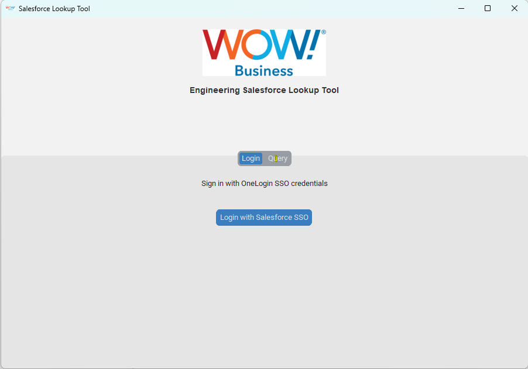
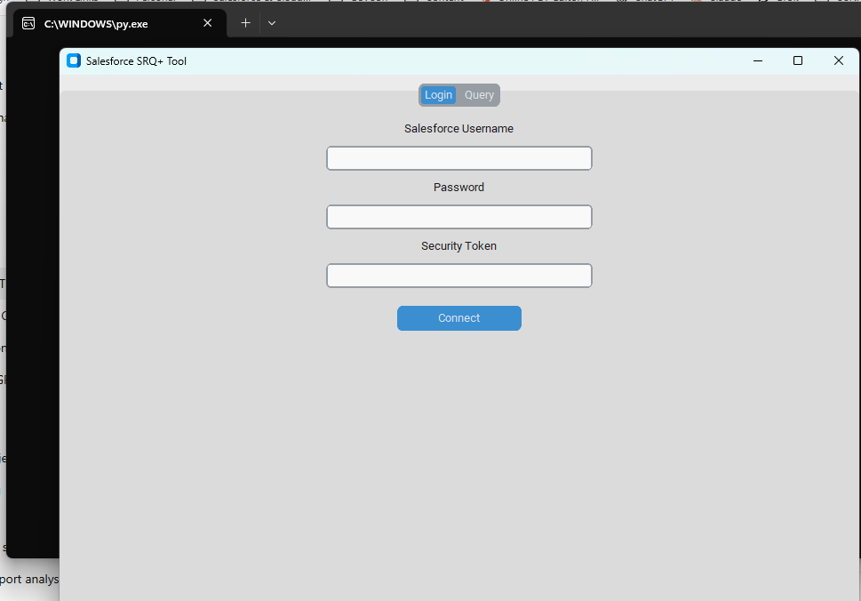
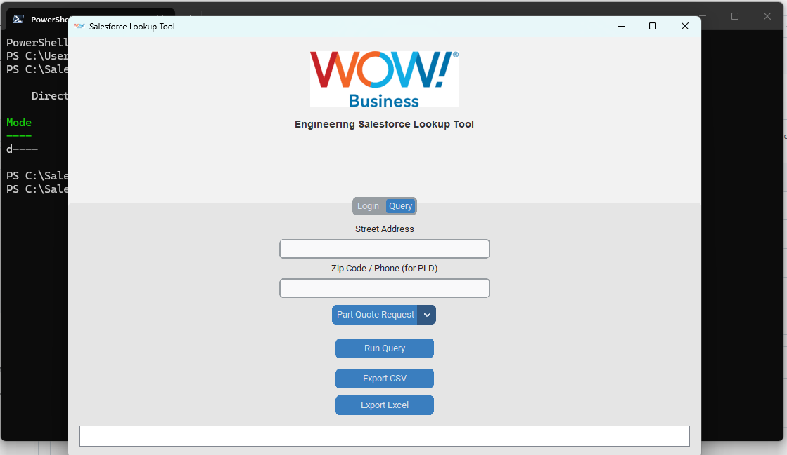

# 🚀 Salesforce Lookup Tool  
### Author: [Lewis Stargill (Stlewis15)](https://github.com/Stlewis15)

## 🧩 Project Overview
The **Salesforce Lookup Tool** is a custom-built desktop application designed to simplify internal Salesforce data lookups through a user-friendly GUI.  
It was originally developed as part of an engineering initiative to reduce manual Salesforce queries, streamline construction and sales request lookups,  
and improve visibility into customer data — all without requiring users to log directly into Salesforce.

Built with **Python**, **CustomTkinter**, and **Salesforce OAuth (OneLogin SSO)** authentication,  
this tool combines secure access control with a modern interface that is simple, fast, and reliable.

---

## ⚙️ Key Features
- 🔐 **Secure OAuth 2.0 (OneLogin SSO)** authentication — No direct credential storage or token exposure.  
- 🧑‍💻 **Modern CustomTkinter GUI** — Flat, responsive interface with dynamic dark/light mode.  
- 🧾 **Real-time Salesforce Queries** — Fetches data from Construction, Sales Requests, and Phone Line Detail objects.  
- 📁 **Data Export Options** — Export results easily to `.csv` or `.xlsx` formats for reporting.  
- 👤 **User Awareness** — Displays the logged-in user name via OneLogin.  
- 🟧 **Custom Branding** — Includes WOW! Business logo banner and corporate color scheme.  
- 🖥️ **Resizable Interface** — Logo dynamically scales with window resize events.

---

## 🧠 Why This Tool Was Built
While working with the **WOW! Engineering Team**, Salesforce users often needed to perform  
construction cost checks, sales request validations, and phone line lookups directly —  
but without accessing Salesforce’s browser interface.

This desktop tool provides a **simplified, read-only view** of Salesforce data,  
integrated securely through **SSO** and **Connected App** configuration.  
The project also served as a **Python GUI learning and automation prototype**,  
demonstrating how internal tools can be rapidly developed for enterprise efficiency.

---

## 🏗️ Technical Stack
| Component | Description |
|------------|-------------|
| **Language** | Python 3.x |
| **GUI Framework** | [CustomTkinter](https://github.com/TomSchimansky/CustomTkinter) |
| **API Access** | Salesforce REST API (via `simple_salesforce` + OAuth2Session) |
| **Data Handling** | `pandas` for structured data and exports |
| **SSO Auth** | OneLogin SSO → Salesforce Connected App (OAuth2 flow) |
| **UI Enhancements** | PIL for image handling (logo/banner resizing) |
| **Deployment** | Desktop application (can be compiled into .exe with PyInstaller) |

---

## 📸 Screenshots

### 🔹 OAuth Login Screen (SSO)


### 🔹 Legacy Salesforce Token Login (v1)


### 🔹 Query Interface


---

## 🔑 Login Flow (Simplified)
1. The user clicks **“Login with Salesforce SSO”**.  
2. The app launches the OneLogin authorization page.  
3. Upon successful authentication, Salesforce returns a **redirected OAuth token**.  
4. The app exchanges that token for an **access token** and retrieves user info.  
5. The GUI displays *“You are now logged in as John D.”* and allows data queries.  

---

## 🧰 Example Queries
- **Construction__c** → Cost and transport data by address.  
- **Sales_Request__c** → Sales request type, assigned rep, and cost fields.  
- **Phone_Line_Detail__c** → Hosted VOIP customer and hunt group information.  

Each query returns up to 200 results and displays them in an interactive table  
with export capabilities.

---

## 🪄 How It Works (High-Level)
```python
sf = Salesforce(instance_url=token["instance_url"], session_id=token["access_token"])
data = sf.query_all("SELECT Name, Address__c FROM Construction__c LIMIT 200")
